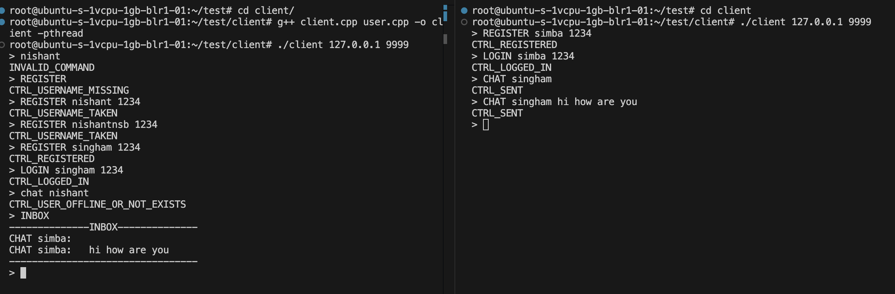

# Command Line Chat Application

An application to chat with other users in the command line itself. No need to download other apps, you can open your favorite terminal, run a command and start chatting with whoever you want to chat.

## Features

- One on one chat
- Group Chat
- Block/Unblock User
- Create groups
- Admin privileges in groups
- Join/leave groups
- Chat in groups
- Username password authentication
- Add/remove member from group
- Promote/Demote Admin
- Clear inbox
- Secure password storage using hashing
- Used filesystem to store data
- Unique username for user and group

## Tech Stack

**C++**: The core language used to create the project.

**pthread**: To implement multithreaded server.

**OpenSSL**: To hash password.

**Socket**: To send and receive messages between ports.

## Run Locally

Clone the project

```bash
git clone https://github.com/menishantsharma/Command-Line-Chat-App
```

Go to the project directory

```bash
cd Command-Line-Chat-App
```

Install Build Essential

```bash
sudo apt install build-essential
```

Install OpenSSL library

```bash
sudo apt-get install libssl-dev
```

Change Directory

```bash
cd server
```

Build server

```bash
g++ server.cpp user.cpp auth.cpp offline_messages.cpp groups.cpp block.cpp -o server -lpthread -lcrypto
```

Run server
```bash
./server 9999
```

Change Directory
```bash
cd ../client
```

Build client

```bash
g++ client.cpp user.cpp -o client -pthread
```

Run client
```bash
./client 127.0.0.1 9999
```
## Commands

- ```REGISTER <username> <password>``` - Register a new user.
- ```LOGIN <username> <password>``` - Login to the server.
- ```CHAT <recipient> <message>``` - Send a private message to a user.
- ```INBOX``` - View your inbox.
- ```CLEAR_INBOX``` - Clear all messages in your inbox.
- ```CREATE_GROUP <group_name>``` - Create a new group.
- ```JOIN_GROUP <group_name>``` - Join an existing group.
- ```LEAVE_GROUP <group_name>``` - Leave a group.
- ```GROUP_CHAT <group_name> <message>``` - Send a message to a group.
- ```BLOCK <username>``` - Block a user from messaging you..
- ```UNBLOCK <username>``` - Unblock a user.
- ```LOGOUT``` - Log out from the server.
- ```ADD_MEMBER <group_name> <username>``` - Add a member to a group (admin only).
- ```REMOVE_MEMBER <group_name> <username>``` - Remove a member from a group (admin only).
- ```PROMOTE <group_name> <username> ``` - Promote a member to admin (admin only).
- ```DEMOTE <group_name> <username> ``` - Demote an admin to a regular member (admin only).
- ```EXIT``` - Exit the application.
- ```HELP``` - Show the help menu.


## Screenshots



## Authors

- **Nishant Sharma** - MTech CSE Student at IIT Bombay
- **Github** - [@Nishant Sharma](https://github.com/menishantsharma)

## License

[MIT](https://choosealicense.com/licenses/mit/)

